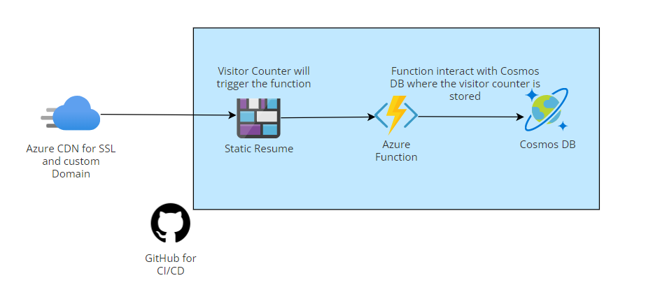

# Azure Resume
Azure resume using azure cosmos DB, Azure function and a blob storage. 

View it live [here](https://www.medinacarlos.me)

## Front-end resources
 The frontend is a static site with HTML, CSS and JavaScript which has a visitor counter, that fetch the data via an API call to an Azure Function.

 - I used this [template](https://www.styleshout.com/free-templates/ceevee/) to create my site.
 - How to use JavaScript Fetch API  to get data [article](https://www.digitalocean.com/community/tutorials/how-to-use-the-javascript-fetch-api-to-get-data).
 - This is how you can [deploy static site to blob storage.](https://docs.microsoft.com/en-us/azure/storage/blobs/storage-blob-static-website-host).

## Back-end resources
The Back-end is an [Azure Function](https://docs.microsoft.com/en-us/azure/azure-functions/functions-bindings-http-webhook-trigger?tabs=in-process%2Cfunctionsv2&pivots=programming-language-javascript) with Azure CosmosDB

- [Create an HTTP triggered Azure Function in Visual Studio Code.](https://docs.microsoft.com/en-us/azure/azure-functions/functions-develop-vs-code?tabs=csharp)
- [Retrieve a Cosmos DB item with Functions binding.](https://docs.microsoft.com/en-us/azure/azure-functions/functions-bindings-cosmosdb-v2-input?tabs=csharp).
- [Write to a Cosmos DB item with Functions binding.](https://docs.microsoft.com/en-us/azure/azure-functions/functions-bindings-cosmosdb-v2-output?tabs=csharp).

## Testing Resources
The visit counter was tested using Xunit.net, please refer to the following resources 
- [Getting Started with xUnit.net](https://xunit.net/docs/getting-started/netcore/cmdline).
- [How to setup Xunit with Azure Functions](https://madebygps.com/how-to-use-xunit-with-azure-functions/).
## CI/CD Resources
- This [article](https://docs.microsoft.com/en-us/azure/storage/blobs/storage-blobs-static-site-github-actions) shows you how can you deploy a blob storage static site with GitHub actions.
- This [article](https://docs.microsoft.com/en-us/azure/storage/blobs/storage-blobs-static-site-github-actions) shows you how can you deploy an Azure Function to Azure with Github Actions.
